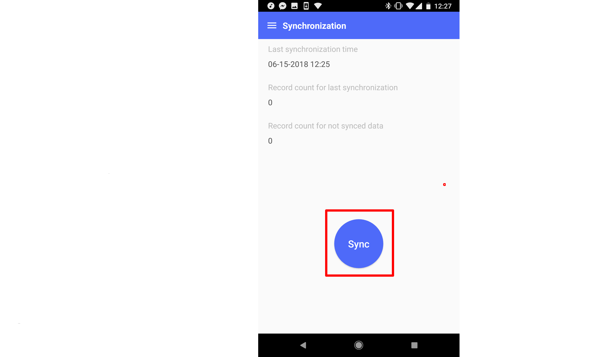
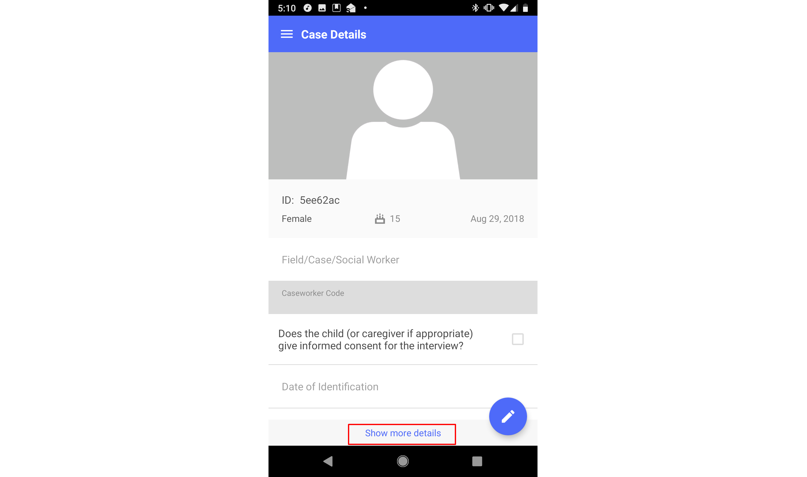
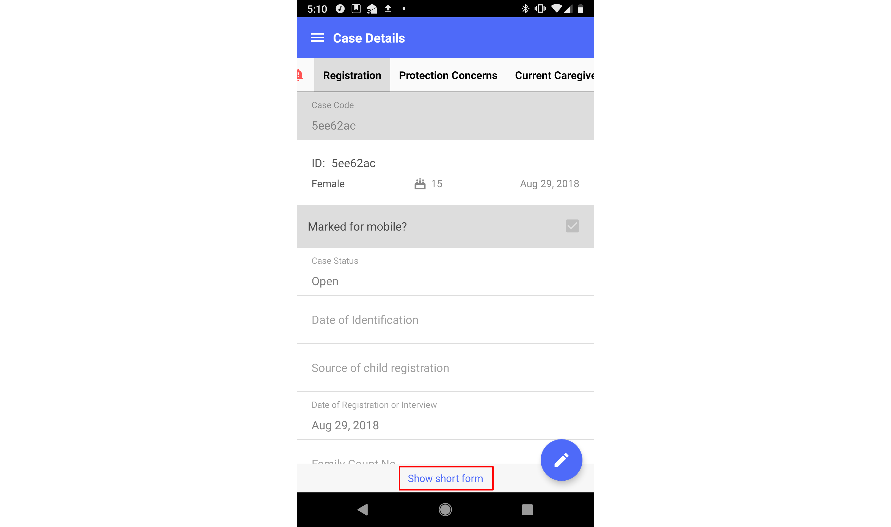
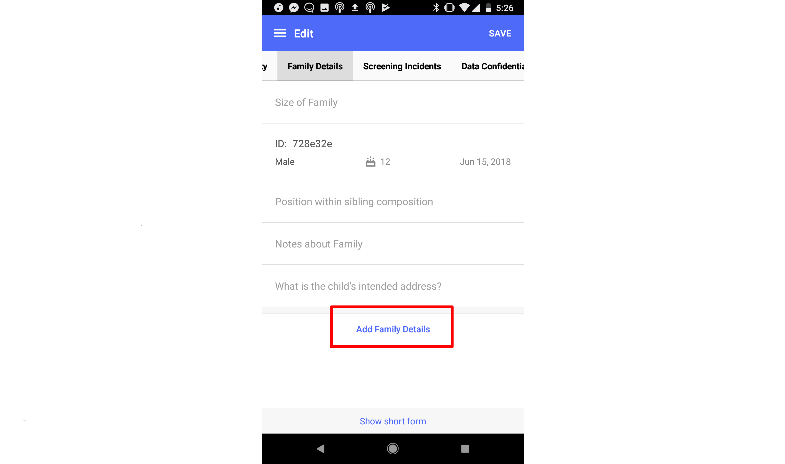

# Major Features

 * Creation, modification and list view for case and tracing request
 * Uploading picture and audio for case and tracing request
 * Show and hide detail on list view
 * Search case and tracing request
 * Syncing data between mobile app and web app

## Icons Used

Menu (to show left side menu tab)

Logout (to logout of the app)

Plus button (to add a new record)

Pencil button (to edit a record)

Add incident button (to add an incident to a case)

Magnifying glass button (to search for a record)

Globe button (to search for a record online)

Trash can button (to remove a case, tracing request, or incident record from your device)

Eye button (to hide or show record details in the cases, tracing requests, or incidents list)

Sync button (to initialize synchronization process between web and mobile)

# Login

## Login Page

Enter the username, password and web URL, then tap on the Login button. Currently the mobile application supports multiple users using one device and data security on single device is developed.

## Main Menu

The application will automatically redirect to main menu after login.

# Cases

## Case List

Select "Cases" on main menu, then the case list will be displayed (there won’t be any existing records if it’s a first-time login).

You will notice that some cases have small, red bell icons next to them. These are cases with new notes from managers. We will learn more about these notes in the View Case section.

## Create Case

Tap on the plus icon on the bottom right of page.

The "Short Form" of the case creation page will then be displayed. The short form allows users to enter a case record with basic information only. For more information on the short form and how to view and edit information in the "Full Form," please see the below section labelled **Switching Between the Short Form and the Full Form**. For reference, the admin "Show on Short Form" option from the Primero admin interface is shown below.

Add detailed information for this case.

Please note that when selecting information from a long list (picklist fields), a text field may be available to search for specific values, depending on your system's configuration.

On some devices, the keyboard will automatically show up, if it’s not needed, please tap the “Back” button on your device to hide the keyboard.

### Adding Photos

To add a photo to the case, select the camera button.

To take a new photo, select "From Camera." To select an existing one, select, "From Gallery."

To add another photo to the case, select the '+' button next to your existing pictures.

### Adding Audio

To add an audio clip to the case, tap the microphone button at the bottom of the short form, or on the "Photos and Audio" form while using the "Full Form."

An audio recording interface will appear, and any sound will be recorded. To stop recording, hit the square stop button.

Once you have finished recording, the microphone will turn into a speaker button. Tap this button to hear the audio you just recorded. Tap the square stop button to stop listening. You can delete your audio clip by tapping the trashcan icon next to your audio clip.

## View Case

On the case list page, tap on any row to view the details of that case.

### Switching Between the Short Form and the Full Form

When viewing, creating, or editing a case, you will, by default, see the "Short Form," which is a limited set of fields which have been set in your configuration to appear here. To see and / or edit more fields, you can see the "Full Form" by scrolling to the bottom of the page and tapping the "Show more details" button.

You will now see the full set of forms and fields which have been set to appear on the mobile device. To switch between forms, swipe left or right.

To move back to the short form, tap the "Show short form" button.

### Viewing Manager Notes

You may notice that, when viewing the full form set, one of the form headers (for the "Notes" or "Other Comments" form) at the top of your screen has a small bell-shaped icon on it. This indicates that your manager has recently added a note to your case.

You can swipe over to this form or click on the form header to see the information in this form. All the notes on your case will here. Notes are sorted in chronological order, with the newest note at the top. To see the newest note (at the top), click on it, and the note will expand to show all of the information about the note, including subject, date added, and full text.

For more information about how managers can add notes to a case through the web application, please see the **Primero CPIMS User Guide**.

## Edit Case

When viewing a case, you can begin editing it by tapping the pencil icon at the bottom right of the screen.

Once you have added information, you can save your changes by tapping the "Save" button at the top right of the screen.

## Adding an Incident to a Case

Depending on your configuration, you may be able to create an incident related to this case. (Note: You can add more than one related incident for a single case.) To do this, tap the add incident icon at the top right of the view case page.

Now enter information about the incident and save.

You can go to the incidents from your case by opening the full forms using the "Show more details" button and then navigating to the "Action Plan" form.

## Subforms

For some specific forms, multiple "subforms" can be added. Family Details is a good example. If your configuration has the Family Details form set to appear on mobile, you can add subforms here. To try this out, edit a case, and then tap "Show more details" to see the full form set. Now swipe right until you reach the family details form.

You should see a link that says "Add Family Details." Tap this link, and a subform will appear. Fill out the fields in this subform to record information about a family member.

To delete a subform entry, scroll down to the bottom of the subform and tap the red "Delete" link.

Tap "Delete" in the confirmation modal that appears.

## Delete Cases From Your Device

On the list of cases, tap the trash can icon at the top right.

You can now select which cases you would like to remove from your device using the check boxes to the right of each case. Once you have seleceted all the cases you would like to delete, press the "Delete" button at the bottom left and then tap "Yes" in the confirmation modal that appears.

Please note that, if these cases were already synced to the server, they will reappear on your device the next time you sync. Using the above process only deletes case *from your device*. Please note that any records which have not been synced with the server will appear as greyed out. You will not be able to select these records for deletion.

## Search Cases

From the case list, tap on the magnifying glass icon.

Enter information to search cases by ID, name, current caregiver name, age, and registration date.

Tap "Done," and search results will appear. To edit your search parameters, tap the bar at the top containing your current search parameters.

## Search Other Users' Cases on Web

During periods when you have internet connectivity, you may wish to search for existing cases belonging to other users on the server. Your ability to perform this action will depend on your user account's configuration. To perform an online search from the cases list, tap the globe icon at the top right of the screen.

Here, you will be prompted to enter the ID you are searching for. This ID can be any searchable ID field, such as a National ID or Other Agency ID. When you are ready to search, tap "Done."

If there are results, you will see a notification asking you to login to the web app. You will then see the web app login page. Login here the same way you would on the web app.

Once you have logged in, you will see your search results. You can click on the "View" button to see some details of the case. To leave the view modal, click the small 'x' button at the top of the modal.

You can also see more details of a case by tapping the small '+' to the left of it.

To add an incident or service to one of the results in the list, select the check box next to the result and then tap the "Add Incident" or "Add Service Provision" button at the top of the screen. Fill out the forms that appear and save the information you entered just as you would on the web app. For more information on how to add incidents or services to cases as part of a search, please see the **Primero CPIMS User Guide**.

If, after entering your search query, there are no results, you will see a notification telling you so. If you would like to return to the mobile app at this point or at any point, tap the "Mobile" button at the top right of the screen.

## Sort Cases

On the case list, tap the "Order by" bar at the top of the screen. Then select a new rule for ordering your cases. Your cases will now appear sorted according to this rule.

# Incidents

Incidents work similarly to how cases work. To view the incidents list, tap on "Incidents" on the main menu.

To view an incident, tap on its corresponding row in the incidents list.

Creating, editing, viewing, and using subforms works exactly the same for incidents and cases. Searching, sorting, deleting, and switching between the short and full forms works exactly the same as well. For instructions on how to perform these actions on an incident, please see the **Cases** section.

# Tracing Requests

Tracing requests work similarly to how cases work. To view the tracing requests list, tap on "Tracing Requests" on the main menu.

To view a tracing request, tap on its corresponding row in the tracing requests list.

Creating, editing, viewing, and using subforms works exactly the same for tracing requests and cases. Searching, sorting, deleting, and switching between the short and full forms works exactly the same as well. For instructions on how to perform these actions on a tracing request, please see the **Cases** section.

# Synchronization

Select Synchronization on main menu. The Synchronization page will then appear with sync related information.

If you tap on the Sync button, a popup will appear with sync progress.

After records in mobile app are synced to web app, Primero will automatically pull records from the web which are marked for mobile.

Once the sync has completed, the information on the sync page will update, and the synced records will appear in their respective record lists.

## Selective Syncing

Some subforms perform "selective syncing." This means:
 * Subform entries added to the case from the web app will not appear on your mobile device.
 * Subform entries you add to the case on the mobile device will sync up to the web app once you sync, and will no longer appear on the mobile app.

The below diagram illustrates how this process works in a system where the "Family Details" form syncs selectively.

# Uninstalling the App

In times of emergency, users can uninstall the Priemro app through one of two methods. Please note that, by uninstalling the app, you will also be deleting all of the record information stored in the app.

## Drag and Drop

The first method is to tap and hold down on the icon for the Primero app. A "App info" link will appear above the icon.

Still holding your finger down, drag the app until you see a trash can icon with the label "Uninstall." Drag the Primero icon over this uninstall icon and then let go. You will see a confirmation modal asking you to confirm that you want to uninstall the app. Tap "OK."

## Using Settings

The second method requires that you navigate to the Settings app on your device. Once you have tapped on "Settings" and entered the Settings app, find the link labelled "Apps." (Note: This will display differently on different devices. On some it may say "Applications." In the picture below, it is labelled "Apps & notifications.")

You should now see a row for the Primero app. Tap this row.

You will now see a button that says "Uninstall." You will then see a confirmation modal. Tap "OK" to uninstall.

